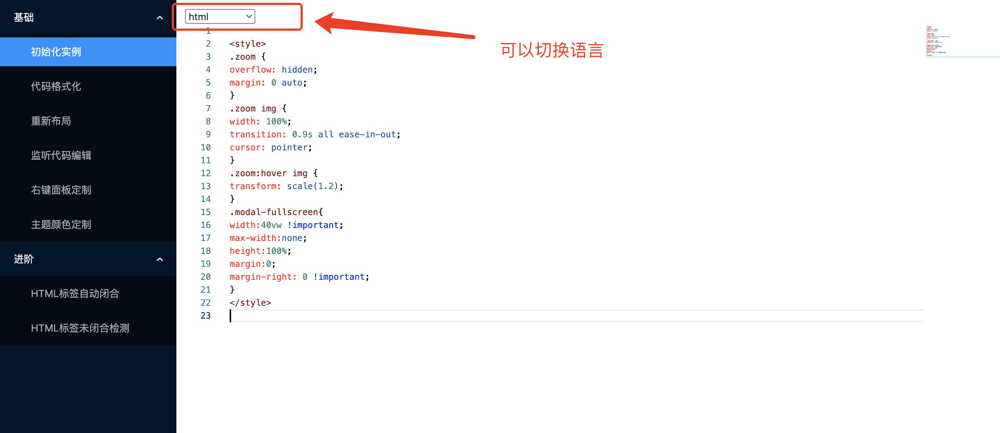
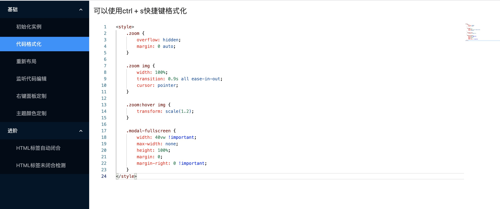
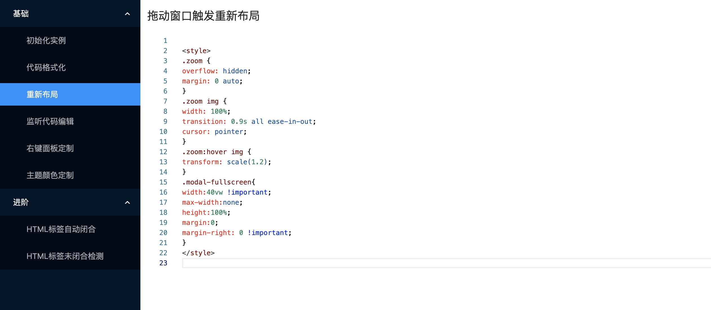
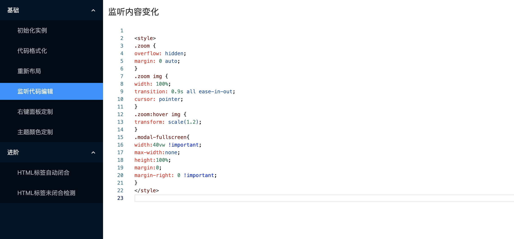
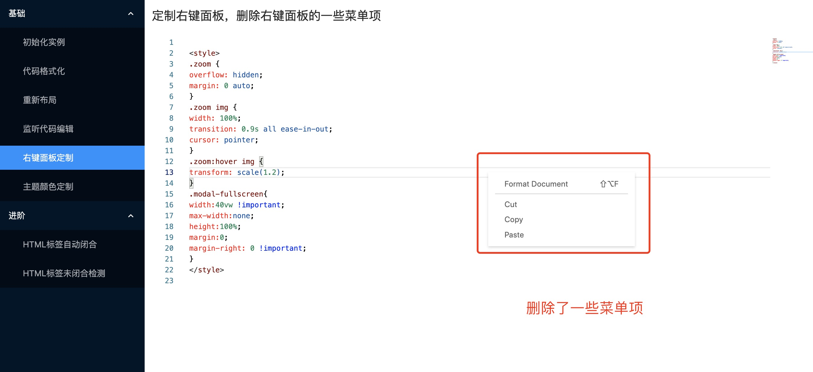
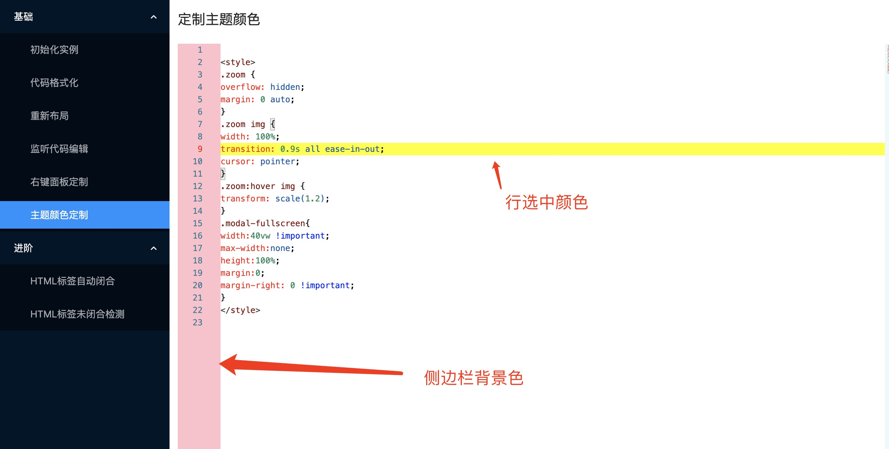
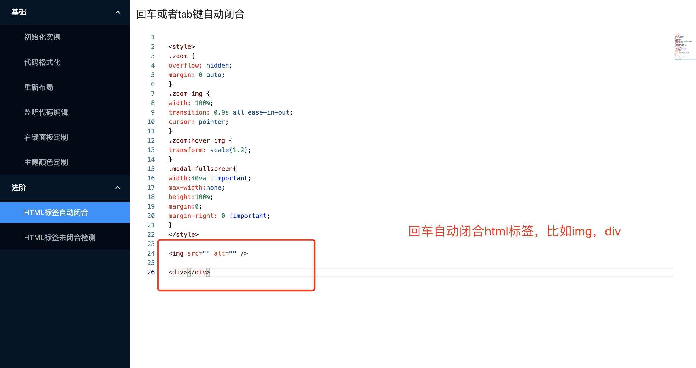
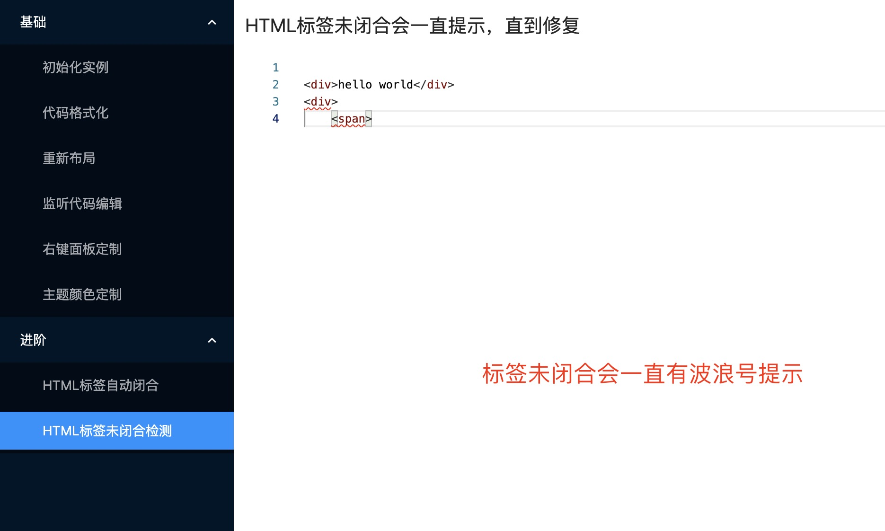

## Monaco Editor App

本仓库用于演示[Monoca Editor](https://microsoft.github.io/monaco-editor/)的用法。本项目已部署在 github page，可以通过[https://lizuncong.github.io/monaco-editor-app/](https://lizuncong.github.io/monaco-editor-app/)访问

## 运行

- node 版本：14.18.1，npm 版本：6.14.15。如果发现安装的依赖不对，可以对齐下 node 和 npm 版本
- 运行项目：
  - npm install
  - npm run start

## 简介

monaco editor 是 vscode 官方提供的一款在线代码编辑器插件，功能强大，但是 API 文档真心难看。因此我特开一个项目专门用于演示 monaco editor 的用法。虽然本项目基于 React 开发，但不影响在其他框架中使用，因为这里我也没有做二次封装，都是直接调用 monaco editor 的 API。

欢迎有兴趣的朋友给本项目提交 demo

## 目前实现的部分功能如下所示

### 初始化实例以及切换语言

### 代码格式化

通过 ctrl + s 快捷键组合可以格式化代码

### 重新布局

### 监听代码编辑

### 右键定制面板

### 主题颜色定制

### HTML 标签回车自动闭合

### HTML 标签未闭合检测

如果忘记闭合 html 标签，则会一直波浪号提示

hover 波浪号有提示

## issues 集锦

- [关于语法错误自动检测](https://github.com/microsoft/monaco-editor/issues/1527)

- [如何添加自定义语言](https://github.com/microsoft/monaco-editor/issues/1477)

- [关于自动补全](https://microsoft.github.io/monaco-editor/playground.html#extending-language-services-custom-languages)
